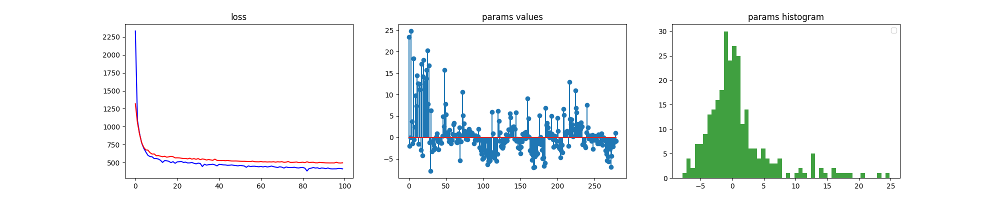
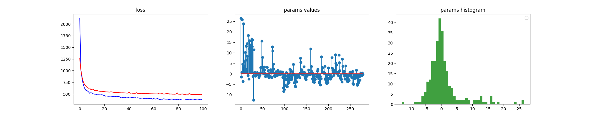
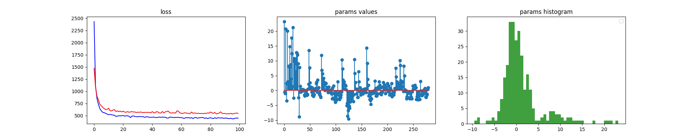

# Problem understanding: Linear Regression with Regularization and Cross-validation #
In this toy project, we aim to build a linear regression model with regularization and cross-validation. </br>

<!-- 
 -->


<!-- <br> -->

# Run the project #
In this project, we have two steps: training and predicting. In the predict step, you can use csv file data from your laptop and predict it. Let's show you how to run the project.

If you do not have venv package, please refer to this [link](https://linuxize.com/post/how-to-create-python-virtual-environments-on-ubuntu-18-04/)
</br>

## Create virtual environment ##

```
$ python3 -m venv ENV_NAME
```
## Activate your environment ##

```
$ source ENV_NAME/bin/activate
```

## Requirement installations ##
To run this, make sure to install all the requirements by:

```
$ pip install -r requirements.txt 
```
# Training the model #

```
$ python3 main.py --epochs --numFold --withKfold  --valL1  --valL2  
```
## Example of running models ##

To use the linear regression with Cross-validation run the following 
```
$ python3 main.py --epochs 100 --numFold 6 --withKfold 1 --valL1 0 --valL2 0 
```
This command bellow is to use the linear regression model without cross validation but with L1 regularization
```
$ python3 main.py --epochs 100 --numFold 6 --withKfold 0 --valL1 0.01 --valL2 0 
```
This command bellow is to une the linear regression model without cross validation with L2 regularization
```
$ python3 main.py --epochs 100 --numFold 6 --withKfold 0 --valL1 0 --valL2 0.01 
```
This command bellow is to use the linear regression model with Elastic Net (L1+L2) without cross validation 
```
$ python3 main.py --epochs 100 --numFold 6 --withKfold 0 --valL1 0.01 --valL2 0.01 
```
This command bellow is for only linear regression model without cross validation and regularization
```
$ python3 main.py --epochs 100 --numFold 6 --withKfold 0 --valL1 0 --valL2 0
```


# Results Presentation


### Linear Regression  </br>


### Linear Regression+Cross Validation  </br>
 


### Linear Regression+ Lasso (L1 regularization)  </br>
 

### Linear Regression+ Ridge (L2 regularization)  </br>
 

### Linear Regression+ ElastikNet (L1+L2 regularization)  </br>
 

___

---
___
